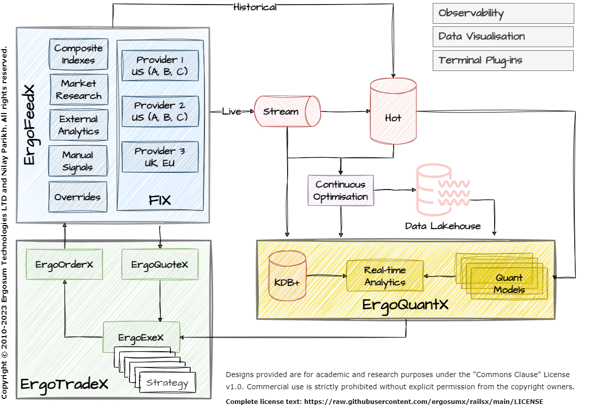

# ErgoEngineX Architecture
## Overview

The ErgoEngineX architecture is designed for flexible deployment, enabling it to be set up in a way that best meets the needs of each organization. Possible deployment options include:

- Local - Single development machine
- Local Distributed - Across multiple desktop machines
- On-Premise - Self-managed server racks
- Private Hosting - With a managed hosting provider
- Public Cloud - Leveraging cloud platforms and services

The reference architecture provides one possible deployment view, but many patterns are possible based on requirements. The components can be self-managed on private infrastructure or deployed using provider-managed PaaS across leading cloud platforms.

This range of deployment options makes ErgoEngineX adaptable to different infrastructure strategies, security models, and operating preferences. The architecture aims to provide a consistent platform for market data and quantitative analysis, while enabling each organization to determine the optimal infrastructure backend.

In addition to packaged deployment across the full architecture, individual ErgoEngineX modules are designed to integrate into existing trading systems and technology estates. Each component can be independently deployed and integrated to meet specific use cases.

For example, clients may choose to leverage only the ErgoFeedX tools for collecting and normalizing market data feeds without adopting the other modules. Alternatively, quant teams could utilize the ErgoQuantX algorithms as an add-on analytics layer while keeping their current trade execution systems in place.

This flexibility aims to lower barriers to incrementally adopt and test components of ErgoEngineX within overall trading workflows. Teams can realize value from specific modules based on their priorities before committing to a full architecture overhaul. The ability to natively interoperate with only the needed capabilities allows for modular adoption with minimal disruption to complement in-house systems.

The ErgoEngineX architecture consists of three main components for collecting data, analyzing data, and executing trades:

### ErgoFeedX
- Collection of tools written in Rust and Python to collect exchange data feeds at low latency in real-time
-Plug-in architecture to add new data sources
-Gets market indexes, research, signals, forecasting models
- Handles data overrides
### ErgoQuantX
- Collection of quantitative analysis algorithms written in Rust, C++, Cython, and Python
- Plug-in architecture to add new algorithms
- Interfaces for streaming data, hot storage (TimescaleDB/PostgreSQL), and data lakes (Iceberg)
- Real-time analytics and machine learning models
- Interfaces with KDB+
### ErgoTradeX
- High performance trade execution engine written in Rust
- Executes trades at lowest latency
- Manages order books

The components are designed to be modular and extensible, handling the full pipeline from data collection to analysis to trade execution. Interfaces allow data and models to flow efficiently between components.

## Deployment
The Ergo architecture supports flexible deployment options:

### Local Development
- Components can be deployed locally using Docker Desktop for development and small scale setups
- Lowers barriers to get started and experiment with components and models
- Docker images provide consistent environments
### Cloud Deployment
- Components designed to scale out across clusters for production workloads
- Kubernetes used to manage containers across hosts
- TimescaleDB and Iceberg leverage scaling of managed - PostgreSQL and object stores
### On-Premise Deployment
- For sensitive workloads, can deployed on private infrastructure
- Bare metal installation with Kubernetes as container orchestrator
- Ensures full control and security

The modular design allows components to be deployed across a mix of on-premise and cloud infrastructure. Containers enable consistency across environments.

## Development Status
The Ergo architecture is currently under active development, with general availability planned for Q3 2024.

### Upcoming Availability
- Q2 2024: Private trials and preview for early customers via invite
- Q4 2024: General availability

The initial releases will focus on core data pipelines, analysis algorithms, and trade execution capabilities, with additional tools and algorithms to be added over time.

If you are interested in participating in the private trials when available or would like to request access when generally available, please reach out to:

- nilay.parikh@ergosum.in
- me@nilayparikh.com

We welcome any feedback from early trial customers to help shape the product as we work towards the initial production releases.
